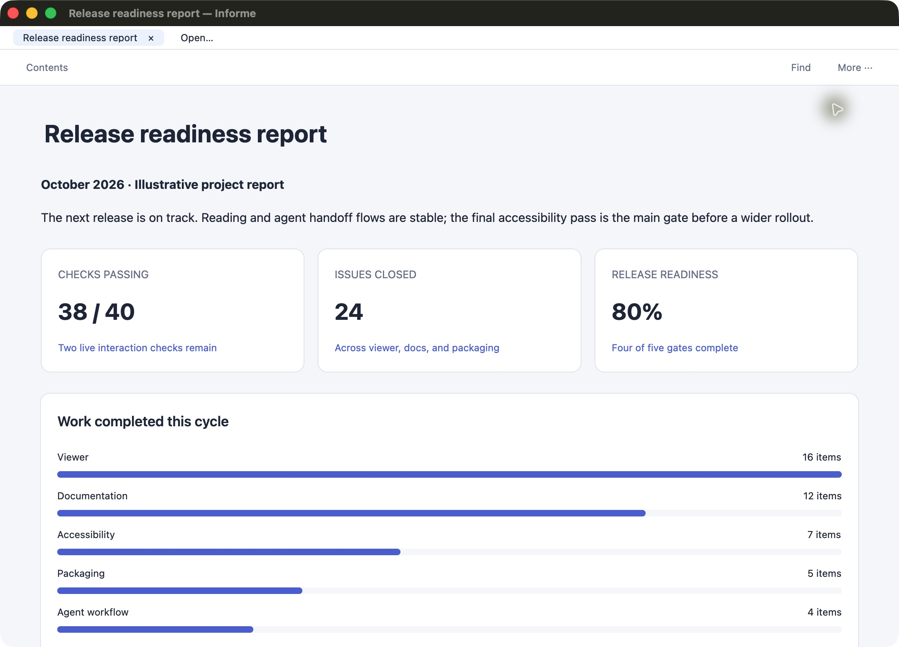

<p align="center">
  
</p>

# Informe

**Native reports for AI agents.**

Turn an agent's output into a readable macOS document. Open Markdown reports and
plans, or semantic JSON dashboards with metrics, charts, and tables. Edit the
file and the native GPUI viewer updates automatically.

This started as a hobby project to explore GPUI. The idea is to give long agent
reports and small dashboards a consistent place to read, explore, and revisit,
with the viewer taking care of presentation.

**Experimental source preview · Apple Silicon · macOS 26 · [MIT](LICENSE)**

Build from source today. Signed downloads and Homebrew installation are planned;
there is no supported prebuilt installer yet.



*Actual native rendering with illustrative sample data.*

## Try it

Install [Rust through rustup](https://rustup.rs/) and Xcode Command Line Tools
(`xcode-select --install`), then:

```sh
git clone https://github.com/nachogea/informe.git
cd informe
cargo run --locked -- examples/viewer/dashboard.json
```

The first build downloads and compiles dependencies. Rustup uses the pinned
[toolchain](rust-toolchain.toml). Apple Silicon on macOS 26 is the verified target;
Intel, older macOS versions, Windows, and Linux have not been verified.

Try a prose report or a plan:

```sh
cargo run --locked -- examples/viewer/report.md
cargo run --locked -- examples/viewer/plan.md
```

## Use it from any project

From the checkout, build and install the CLI:

```sh
cargo build --release --locked
mkdir -p "$HOME/.local/bin"
install -m 755 target/release/informe "$HOME/.local/bin/informe"
export PATH="$HOME/.local/bin:$PATH"
informe --version
```

Add `~/.local/bin` to your shell's PATH for future sessions too. Reinstall after
rebuilding. The installed executable needs no Rust toolchain to run; supply a
document path when using this standalone CLI outside the checkout.

```sh
informe open /absolute/path/report.md
informe --check /absolute/path/dashboard.json
informe open /absolute/path/dashboard.json
```

`open` returns after a valid native frame renders. It reuses the running app and
focuses the existing tab when the same file is already open. Updates appear as
the file changes; an invalid edit leaves the last valid document visible.

For a Dock/Finder application, build the local app bundle with
`sh scripts/bundle-macos.sh release`. See [macOS packaging](packaging/README.md)
for its location and distribution status. Opening documents currently uses the
CLI or **Open…** inside the app; Finder document associations are not implemented.

## Ask your agent

Install the bundled [generation skill](docs/agent-workflow.md#install-the-generation-skill),
then ask naturally:

> Show me a dashboard of this project's progress.

Or:

> Open a report explaining the changes on this branch.

Your agent writes a local document, validates it, and opens the viewer. It needs
filesystem and local process access. Model generation happens in your existing
agent environment; the viewer has no built-in AI API or account requirement.

## Read, explore, and copy

- Open several documents in tabs and return to recent files.
- Find matching blocks with **Command-F** and jump between sections with **Contents**.
- Drag or double-click to select text, then **Command-C** to copy. **Command-A**
  selects the whole document, including content below the viewport.
- Sort table columns; use **Copy TSV** or **Save CSV…** to export source data.
  Sorting changes the view; exports keep the original row order.
- Use **More → Copy document text** or optional PNG copy/export. PNG includes the
  whole document but uses a separate layout and flattens Markdown formatting.
- Use **Command-O** to open a file, **Command-W** to close a tab, and **Command-Q** to quit.

See [using the viewer](docs/usage.md) for supported formats, export limits,
troubleshooting, and where local data is stored.

## How it works

```text
Agent → Markdown or semantic JSON → typed document tree → native GPUI components
```

JSON describes a metric, chart, or callout; the renderer owns the visual style.
There is no browser or WebView in the viewer. A small example:

```json
{
  "version": 1,
  "root": {
    "type": "column",
    "id": "root",
    "children": [
      { "type": "heading", "id": "title", "level": 1, "text": "Project progress" },
      { "type": "metric", "id": "completed", "label": "Completed", "value": "8 / 10" }
    ]
  }
}
```

Keep IDs unique within the document and stable through edits. The
[format reference](docs/artifact-format.md), [JSON Schema](schema/artifact-v1.json),
and [agent workflow](docs/agent-workflow.md) describe the contract.
`informe capabilities` and `informe schema` expose it to agents.

## Status and scope

The core is a local viewer for reports, dashboards, and plans. Charts currently
support one nonnegative horizontal bar series; tables contain string cells.
The format is experimental and may change. Very large documents are not
virtualized. PDF export, hosted collaboration, and editor integrations are not
implemented. Live accessibility acceptance and clean-Mac installation remain open.

Comments and revision feedback are retained as an [opt-in experiment](docs/review.md).
The [roadmap](docs/roadmap.md) tracks future work and [QA notes](docs/qa-2026-10-04.md)
record what has and has not been verified.

[Benchmarks](benchmarks/README.md) contain measured runtime timings and a historical
HTML comparison. They do not establish faster model generation or lower model
usage; the matched generation experiment is still pending.

## Contributing

Bug reports and focused pull requests are welcome. Start with
[CONTRIBUTING.md](CONTRIBUTING.md), the [architecture](docs/architecture.md), or
[open an issue](https://github.com/nachogea/informe/issues).
The [docs index](docs/README.md) links user and contributor references.

Built with [GPUI](https://www.gpui.rs/) and [GPUI Kit](https://github.com/longbridge/gpui-kit).
The experiment was inspired by [Plannotator](https://github.com/backnotprop/plannotator)
and agent artifact previews.

## License

[MIT](LICENSE). Third-party dependencies retain their own licenses.
